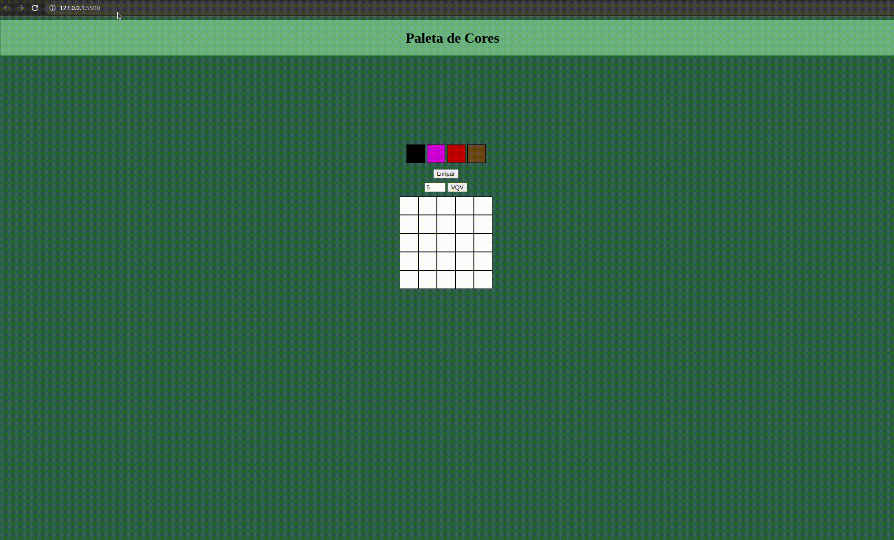

# Boas vindas ao projeto Paleta de Cores!
  Projeto individual durante o curso de desenvolvimento web na trybe.

  Esse projeto foi feito para praticar habilidades de DOM e classes de CSS.

## Habilidades
- Criação de elementos através do javaScript;

- Manipulação de elementos com JS e alteração de classe em elementos;

- HTML e CSS;

## Veja o resultado a seguir do projeto pronto:
  

## Requisitos Obrigatorios:

    ✅ 1. Adicione à página o título "Paleta de Cores".

    ✅ 2. Adicione à página uma paleta contendo quatro cores distintas.

    ✅ 3. Adicione a cor preta como a primeira cor da paleta de cores.
    
    ✅ 4. Adicione à página um quadro contendo 25 pixels.

    ✅ 5. Faça com que cada pixel do quadro tenha largura e altura de 40 pixels e borda preta de 1 pixel de espessura.

    ✅ 6. Defina a cor preta como cor inicial da paleta de cores.

    ✅ 7. Crie uma função para selecionar uma cor na paleta de cores e preencha os pixels no quadro.

    ✅ 8. Crie uma função que permita preencher um pixel do quadro com a cor selecionada na paleta de cores.
    
    ✅ 9. Crie um botão que retorne a cor do quadro para a cor inicial.

### Requisitos Bônus:

    ✅ 10. Crie um input que permita à pessoa usuária preencher um novo tamanho para o quadro de pixels.

    ✅ 11. Crie uma função que limite o tamanho mínimo e máximo do quadro de pixels.

    ✅ 12. Crie uma função para gerar as cores aleatoriamente, com exceção da cor preta, ao carregar a página.

